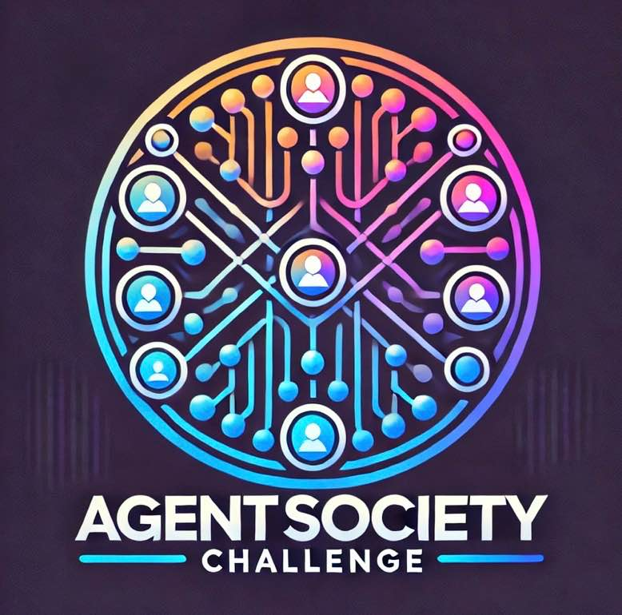
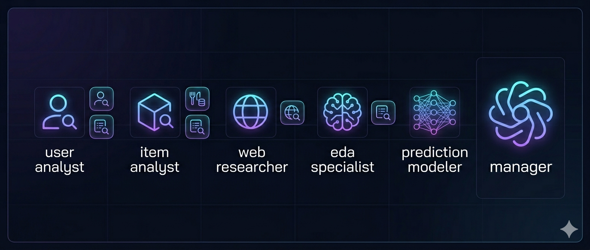
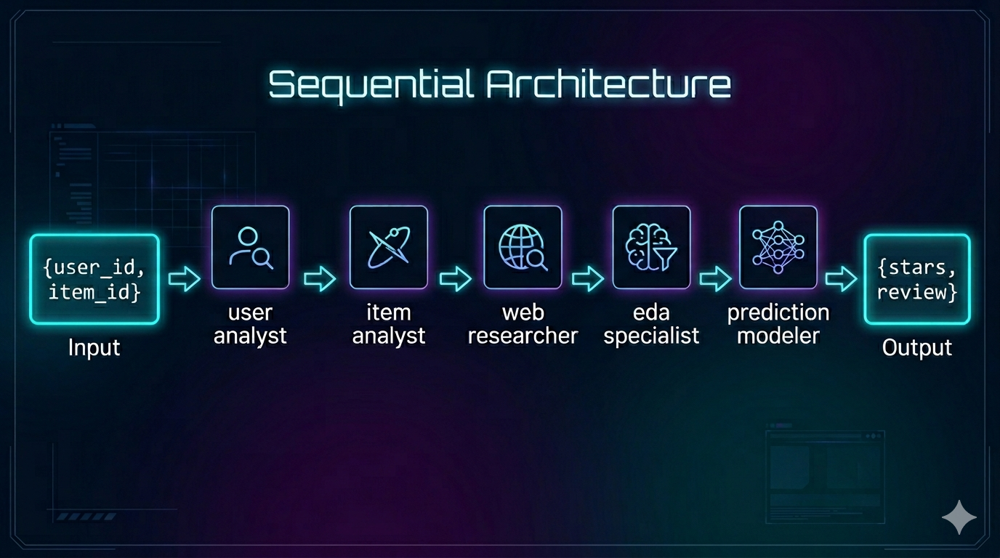
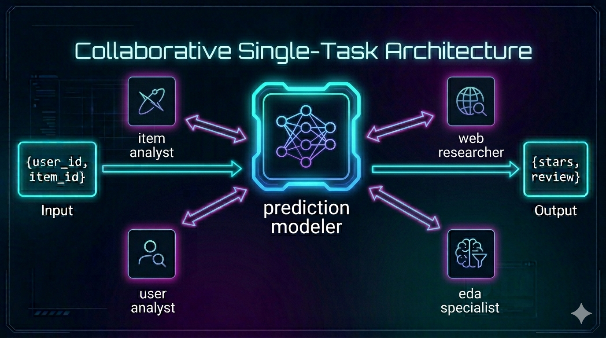
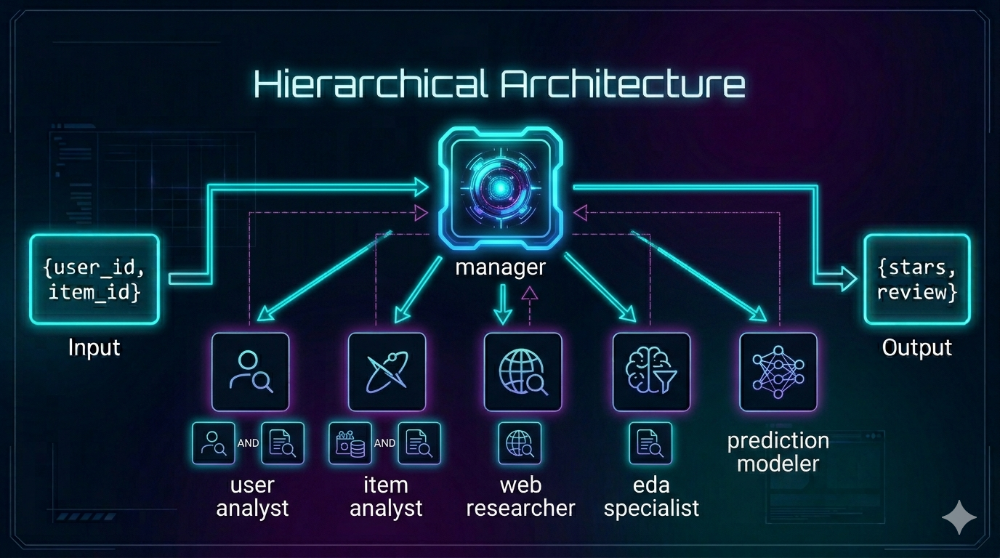

<div style="text-align: center; display: flex; align-items: center; justify-content: center; background-color: white; padding: 20px; border-radius: 30px;">
  
  <h1 style="color: black; margin: 0; font-size: 2em;">WWW'25 AgentSociety Challenge: CrewAI Implementation</h1>
</div>

# 🚀 AgentSociety Challenge - CrewAI Edition

This project integrates the **WWW'25 AgentSociety Challenge** with the **CrewAI** multi-agent framework. It focuses on building intelligent LLM Agents for **user behavior simulation** and **recommendation systems** using advanced orchestration patterns.

---
## Agents


| Agent | Role | Tools |
|---|---|---|
| `user_analyst` | Analyzes user profile and review history | `search_user_profile_data`, `search_historical_reviews_data` |
| `item_analyst` | Analyzes restaurant features and Yelp reviews | `search_restaurant_feature_data`, `search_historical_reviews_data` |
| `web_researcher` | Searches the internet for business reputation and news | `SerperDevTool` |
| `eda_specialist` | Computes star distribution and rating bias for the business | `search_historical_reviews_data` |
| `prediction_modeler` | Synthesizes all inputs and produces the final prediction | — |
| `manager_agent` | Orchestrates delegation across all agents (hierarchical only) | — |

### RAG Tools

All three RAG tools are backed by ChromaDB collections indexed with **BAAI/bge-small-en-v1.5** embeddings:

| Tool | Collection | Source Data |
|---|---|---|
| `search_user_profile_data` | `v3_hf_user_data` | `user_subset.json` |
| `search_restaurant_feature_data` | `v3_hf_item_data` | `item_subset.json` |
| `search_historical_reviews_data` | `v3_hf_review_data` | `review_subset.json` |

Each tool accepts **only a plain natural language string** as `search_query`. Passing structured JSON objects will cause a `FixedJSONSearchToolSchema` validation error.

## 🏛️ Crew Architectures

This project explores three distinct CrewAI architectural patterns to optimize agent collaboration and task execution:

### 1. Sequential Crew — Cascade Pattern


**Logic:** Tasks are executed in a fixed linear order.
- **Workflow:** Each agent is assigned a specific task. Once a task is completed, its output is passed downstream as `context` to the next agent.
- **Best For:** Straightforward pipelines where each step depends directly on the result of the previous one (e.g., User Analysis → Item Analysis → Final Prediction).
- **Process Type:** `Process.sequential`

### 2. Collaborative Single-Task Crew


**Logic:** A single, shared "Master Task" is owned by a lead agent.
- **Workflow:** The lead agent (e.g., `prediction_modeler`) has `allow_delegation=True`. It dynamically pulls in specialists (User Analyst, Item Analyst, etc.) to perform sub-tasks or provide data as needed before synthesizing the final output.
- **Best For:** Complex tasks that require a central "mind" to coordinate multiple specialists without the overhead of a dedicated manager agent.
- **Process Type:** `Process.sequential` (with delegation enabled)

### 3. Hierarchical Crew — Manager-Delegated Pattern


**Logic:** A dedicated `manager_agent` (or an LLM-managed process) orchestrates all work.
- **Workflow:** The manager agent receives the high-level goal and dynamically delegates tasks to workers independently. It can assign tasks in parallel, manage dependencies, and ensure the final output meets all requirements.
- **Best For:** Highly complex workflows where the order of execution might change based on intermediate results, or where parallel execution of sub-tasks is critical for efficiency.
- **Process Type:** `Process.hierarchical`

---

## Performance

| Architecture | Preference Estimation (%) | Review Generation (%) | Overall Quality (%) |
|---|---|---|---|
| Sequential | 82.26 | 78.90 | 80.58 |
| Collaborative | 0.67 | 0.67 | 0.67 |
| Hierarchical | 0.67 | 0.67 | 0.67 |

---

## 📂 Project Structure

- **`src/`**: Contains the core logic and Crew definitions.
  - **`crews/`**: Implementations of the different Crew architectures.
  - **`flows/`**: Higher-level orchestration (e.g., `ServingFlow`) that manages the simulation lifecycle.
- **`config/`**: YAML files defining Agent roles and Task descriptions, strictly separated from Python logic.
- **`websocietysimulator/`**: The underlying simulation environment and tools (Interaction, Evaluation).
- **`data/`**: Processed Yelp/Amazon/Goodreads datasets.

---

## 🛠️ Quick Start

### 1. Prerequisites
- [Astral `uv`](https://github.com/astral-sh/uv) (for blazing fast dependency management)
- Python 3.10+

### 2. Installation
```bash
uv sync
```

### 3. Environment Setup
Create a `.env` file and add your API keys:
```bash
LLM_PROVIDER=nvidia # LLM Selection: nvidia, ollama, or groq
OPENAI_API_KEY=nvidia_api_key
OPENAI_API_BASE=https://integrate.api.nvidia.com/v1

NVIDIA_API_KEY=nvidia_api_key
NVIDIA_MODEL_NAME=nvidia_model_name # e.g. meta/llama-3.1-8b-instruct
NVIDIA_API_BASE=https://integrate.api.nvidia.com/v1
```

### 4. Run Simulation
```bash
# Verify setup with Mock Mode (zero cost)
uv run python run_simulator_test.py --mock

# Run full simulation
uv run python run_simulator_test.py

# If you already have the output
## By default in run_simulator_test.py, the save_dir is simulator_results
uv run python run_simulator_test.py --eval-only
```

---

## 📖 References
- [AgentSociety Challenge Official](https://github.com/tsinghua-fib-lab/AgentSocietyChallenge)
- [AgentSocietyChallenge_w_CrewAI](https://github.com/yuchieh/AgentSocietyChallenge_w_CrewAI)
- [CrewAI Documentation](https://docs.crewai.com/)
- [Project Wiki/Tutorials](./tutorials/)
